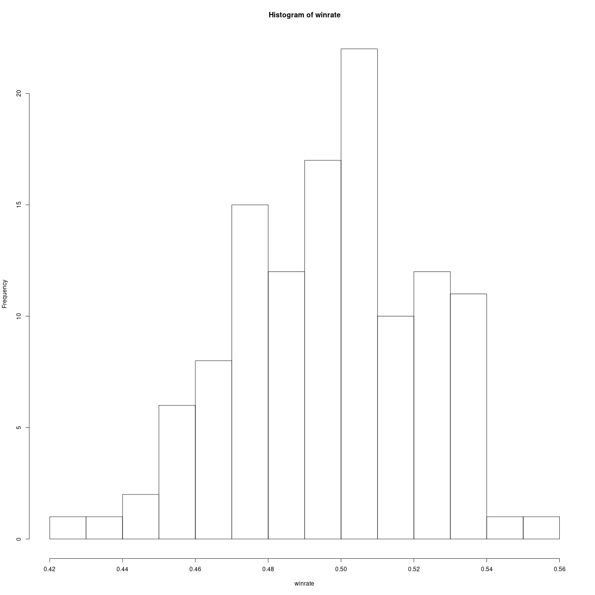
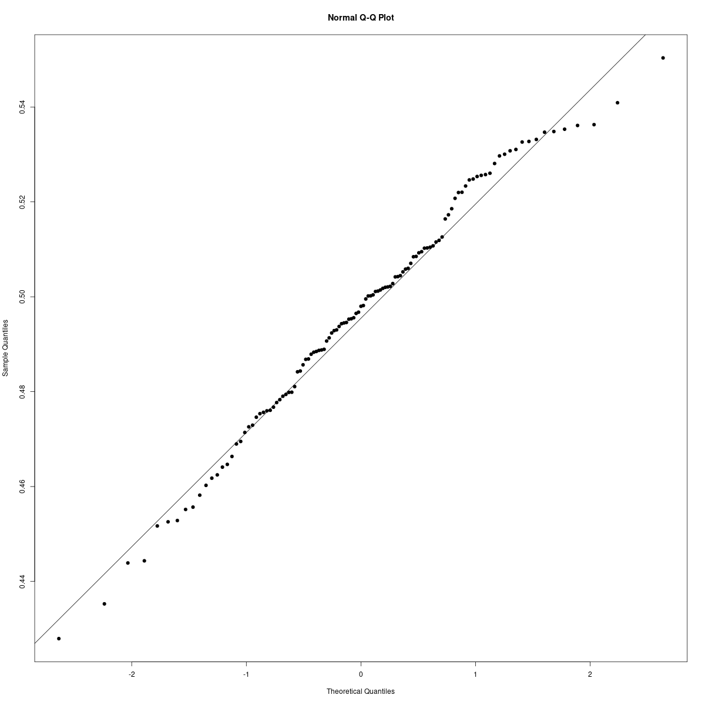
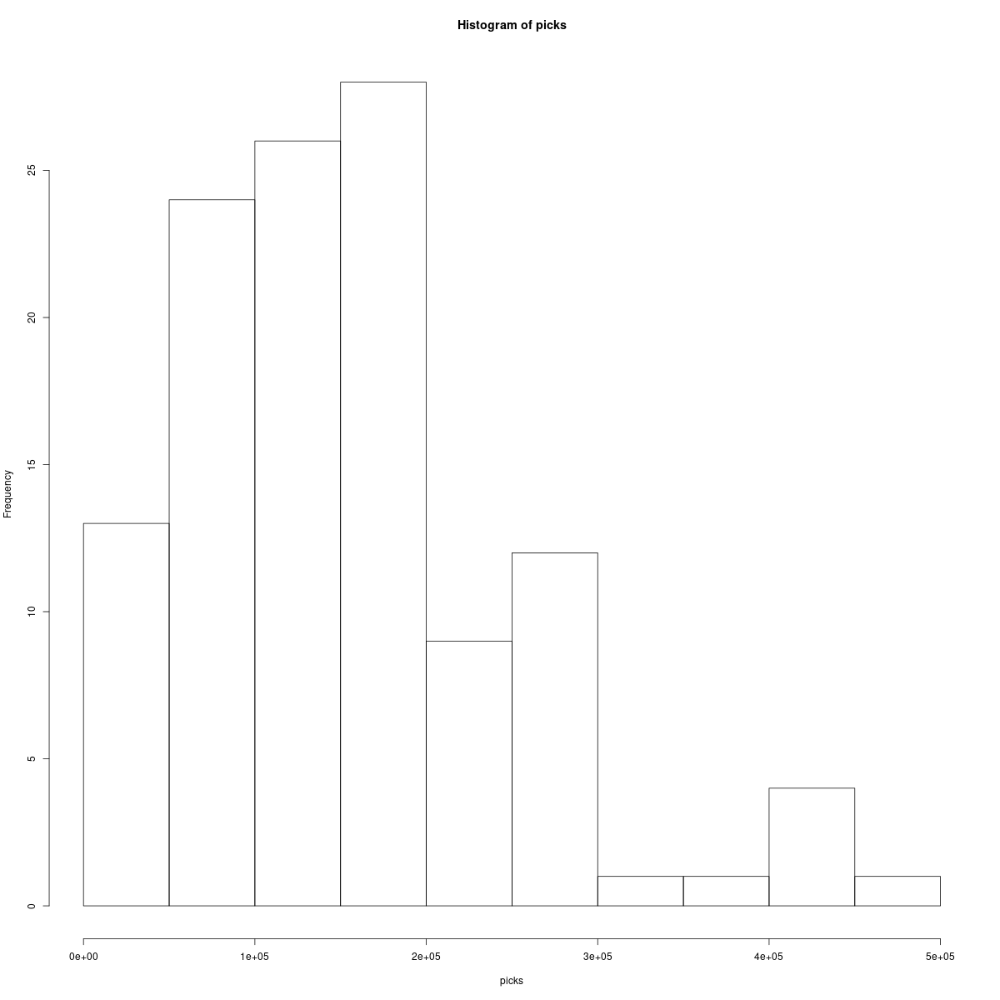
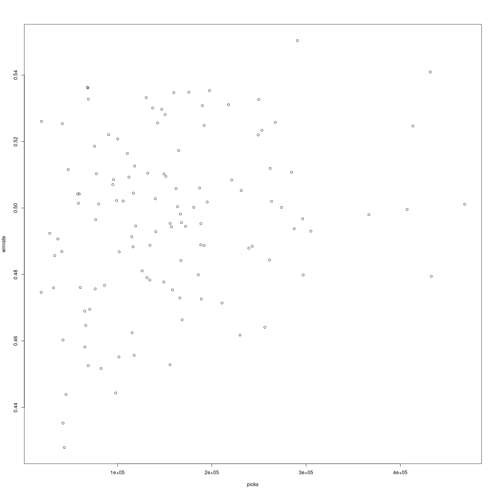

# Георги Любенов, 81248

## Данни
Ще изследваме данни за скорошни игри за играта DOTA2, взети от [API-то на OPENDOTA](https://docs.opendota.com/#tag/hero-stats).

Информацията която ни интересува са статистиките за
* winrate - колко често печели произволен герой, в проценти
* pickrate - колко пъти е избиран даден герой

Оригинално планирах да излседвам и как взаимодейства главният атрибут на всеки герой с тези статистики, но
в последстиве осъзнах че връзката е тривиална (сумираш..) и не ми хрумна друго.

## Цели

0. Да разберем колко е "балансирана" играта.
1. Да разберем има ли връзка между популярността на даден герой с неговия winrate.

## Winrate

Да разгледаме хистограма на печалбите на всеки герой:


Това изглежда като нормално разпределение.

Проверявайки го със `Shapiro–Wilk`:
```R
> shapiro.test(winrate);

        Shapiro-Wilk normality test

data:  winrate
W = 0.98628, p-value = 0.2719
```

подкрепя(`p>0.05`) това.

Както и гледайки `qqplot`:



Следователно ще гледаме параметрите му:
```R
> mean(winrate)
[1] 0.4963748
> var(winrate)
[1] 0.0006287858
```

Тъй като дисперсията е ниска, можем уверено да заключим, че играта е "балансирана" - почти всички герои са с неутрален winrate.

Изненадващо е че средната стойност не е точно `0.5`, но това най-вероятно се обяснява с факта че има игри, които могат да бъдат записани
като нито загуба, нито победа (например ако играч напусне играта твърде рано).

## Популярност (pickrate)

Отново, да погледнем хистограма на колко често са избирани герои:


Виждаме нещо което не изглежда като нормално разпределение, по-скоро приличащо на експоненциално.

Пускайки му `Shapiro–Wilk`:
```R
> shapiro.test(picks)

        Shapiro-Wilk normality test

data:  picks
W = 0.92402, p-value = 4.515e-06
```

Потвърждава(`p<0.05`) този факт.

Следователно ще гледаме медианата и IQR-то му:
```R
> median(picks)
[1] 142539
> IQR(picks)
[1] 112276.5
```

Не забелязах нещо по-интересно за тези данни, освен че има малко на брой герои които са outliers (масивно по-популярни от другите).

## Популярност vs Winrate

Гледайки dotplot-а им, ни навежда към мисълта че няма особена връзка между двете:



Дори масивно популярните герои не показват знак да са "по-силни".

Гледайки корелацията им потвърждава това:
```R
> cor(picks, winrate)
[1] 0.2399816
```
